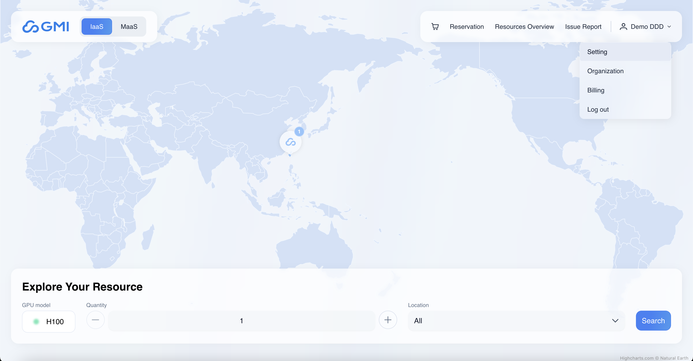

# Cluster Engine User Manual

**Cluster Engine Version**: 2.1.0

# User Management

## Login

1. Connect to the Cluster Engine web and Click on the Log In.

1. Enter your username and password

1. Enter Verification Code

## Logout

1. Click on the user profile in the top-right corner of the navigation bar.
2. Select **"Logout"** from the dropdown menu.

## Change Password

1. Click on the user profile in the top-right corner of the navigation bar.

1. Select **"Change Password"** from the dropdown menu.
2. Enter your current password and the new password.

## Organization

### Member List

1. Click on the user profile in the top-right corner of the navigation bar.
2. Select **"Organization"** from the dropdown menu.

1. Navigate to “**Member List**“ to list the organization members

### Invite Members

1. Click “**Invite Members**“ to invite members to your organization by email

## Billing

### Manage orders

1. Click on the user profile in the top-right corner of the navigation bar.
2. Select **"Billing"** from the dropdown menu.

1. Navigate to “**Orders”** to see order history

### View invoice

1. Click “**Invoice**“ icon of an order

### Cancel a pending order

1. Locate the order you want to cancel and click “**Cancel**“
2. Click “**Cancel**“ to confirm

# Marketplace

1. Click **"Marketplace"** in the navigation bar to access the Marketplace.
2. Navigate world map or use search filter to select an IDC

## Rent Bare Metal Servers

### Choose bare metal sever type

1. Select a bare metal type to rent.

1. Enter rental end date and quantity

1. Click “**Next**”

### Bare metal settings

1. Enter bare metal server settings

- **Bare Metal Name**: specify a name for the bare metal server
- **SSH Public key:** ssh public key used for accessing to the server

1. Click “**Next**“
2. Review the summary of the bare metal servers

1. Click “**Add To Cart**“

## Rent Containers

### Choose container spec

1. Select a container template to rent

1. Choose a proper resource spec

**Resource spec:**

- **GPU**: Specify the number of GPU cards required for the container.
- **CPU**: Define the CPU resources needed for the container.
- **Memory**: Set the amount of memory required for the container.
- **Ephemeral Storage**: Allocate the disk space needed for the container.

1. Enter rental end date and quantity

1. Click “**Next**”

### Container settings

1. Configure Container settings

- **Container Name**: Specify a name for the container
- **Ports**: Define the service ports to access the container

- **(Optional) Expose SSH Port**:

> [!WARNING]
> When using container templates provided by GMI Cloud, you can select this option to enable SSH access to the container. Please enter your SSH Public Key.

- **(Optional) Expose Jupyter Notebook Port**:

> [!WARNING]
> When using container templates provided by GMI Cloud, you can select this option to enable Jupyter Notebook access to the container.

- **(Optional) Set Environment Variables**: Define any necessary environment variables for the container.

1. Review the container summary and click “**Add To Cart”**

## Shopping Cart

### Confirm Order Information

1. Chick the “**Shopping Cart**“ icon

1. Edit the product items and click “**Checkout**“

### Complete Order

1. Confirm the price detail and click “**Place Order**“

### Payment

1. Choose a payment method

1. Enter PayPal account and password and Click “Log In“

1. Select a credit card and click “**Complete Purchase**“

1. Order is confirmed. The resources will be launched immediately.

# Resources Overview

## Resource Usage

1. Click **"Resources Overview"** in the navigation bar to access the Resources Overview page.
2. The top of the page displays the total GPU and instance usage status, while the bottom lists the containers and bare metal servers that have been created.

# Bare Metal Resources

## Manage Bare Metal Servers

- Click Bare Metal in the left panel to view all launched bare metal servers.

### Rename a bare metal server

1. Locate the bare metal server you want to rename and click “**Rename**“ from dropdown menu

1. Enter a new name and click “**Submit**“

### Stop a running bare metal server

1. Locate the bare metal server you want to stop and click the “**Stop**” action

### Start a stopped bare metal server

1. Locate the bare metal server you want to start and click “**Start**“ action

### PowerCycle a bare metal server

1. Locate the bare metal server you want to perform power cycle and click “**PowerCycle**“ from dropdown menu

1. Click “**PowerCycle**“ to confirm

### Reboot a bare metal server

1. Locate the bare metal server you want to reboot and click “**Reboot**“ from dropdown menu

1. Click “**Reboot**“ to confirm

# Container Resources

## Manage Containers

1. Click **"Resources Overview"** in the navigation bar.
2. Select **"Containers"** from the sidebar to access the Container page.

### Access Containers

#### ssh

1. Locate a container and click the port “**22**“ icon in the “**Access**“ field
2. Copy the ssh command and paste it to your terminal

#### Jupyter Notebook

1. Locate a container click the port “**8888**“ icon in the “**Access**“ field
2. A Jupyter Notebook web page will be opened in another browser tab

### Container Status Descriptions

| **Status** | **Description** |
| --- | --- |
| **Creating** | The container is in the process of being created. |
| **Running** | The container is currently running. |
| **Terminating** | The container is shutting down, typically appearing briefly during a restart. |
| **Error** | An error has occurred in the container. Check the logs for more details. |

### Edit a Container

1. Locate the container you want to edit and click “**Edit**“ from dropdown menu

1. Enter the container settings you want to edit and click “**Save**“

> [!WARNING]
> The container will restart after editing.

### Restart a Container

1. Locate the container you want to restart and click the “**Restart”** from dropdown menu

### View Container Logs

1. Locate the container whose logs you want to view, and click the “**View Log”** icon to access the logs.

### Download Container Logs

1. Locate the container whose logs you want to download, and click the **"Download log"** to download the logs.

## Templates

### Add a New Template

> [!WARNING]
> Currently, only the `admin` account can add or edit container templates.

1. Click **"Resources Overview"** in the navigation bar.
2. Select **"Templates"** from the sidebar.
3. Click the **"Create Template"** button.

1. Enter the required information and click **"Create"** to add a new container template.

### Edit a Template

1. Click **"Resources Overview"** in the navigation bar.
2. Select **"Templates"** from the sidebar to access the Container Templates page.

1. Click on the container template you want to edit to enter edit mode.
2. Currently, only the following fields can be modified: **Name**, **Description**, **Credentials**, and **Status**.

### Delete a Template

1. Click **"Resources Overview"** in the navigation bar.
2. Select **"Templates"** from the sidebar to access the Container Templates page.
3. Click on the container template you want to edit to enter edit mode.
4. Click the **"Delete"** button on the right to remove the container template.