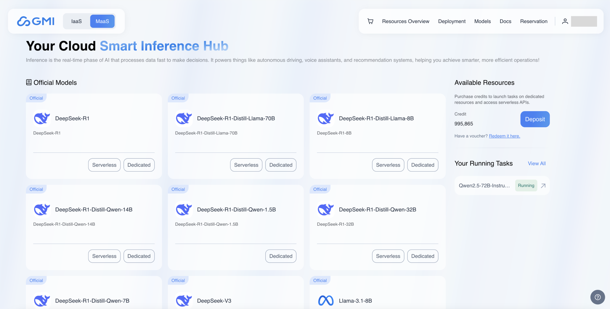
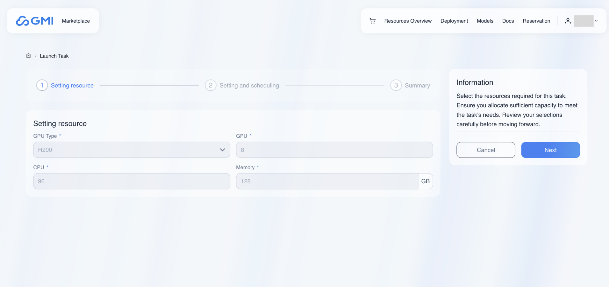
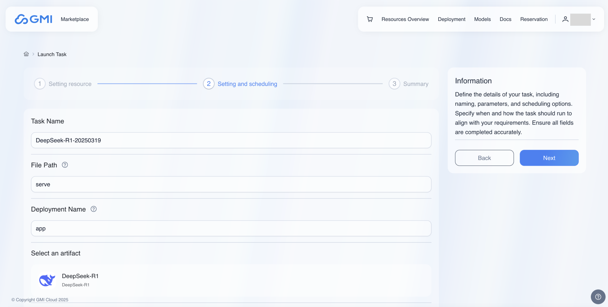
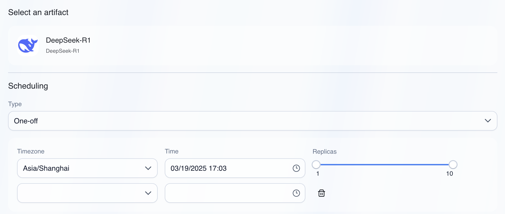
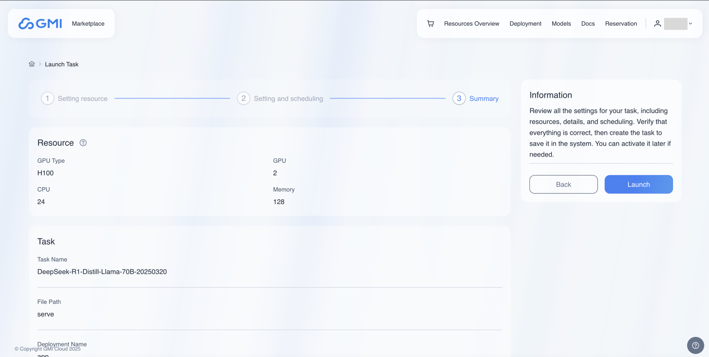

# Dedicated Endpoints
Dedicated Endpoints provide a customizable environment for deploying AI models tailored to specific requirements.

A dedicated endpoint can be created in two different ways, checkout the following guides for more details:
## Created dedicated endpoints from offered models.
Click "MaaS" in the top left corner of the navigation bar to view the models available for dedicated endpoints.

Choose the model you wish to access, click the "Dedicated" button to launch task for dedicated end points. 

1. Setting resource

   The resource cannot be edited; click the "Next" button.

   

2. Setting and scheduling

   **Task Name**: Define task name.

   **File Path**: Specify the script file name to be executed in the Docker image(without the file extension). Fox example, if the image includes a script named serve.py, enter serve here.

   **Deployment Name**: Specify the deployment name that will be exposed to the Ray cluster by the script. For example, you can use app as the deployment name.

   **Type**: One-off or Daily

   ​      One-off - The task runs once as scheduled time.

   ​      Daily - The task runs at the first scheduled time and can update replica numbers at subsequent daily scheduled times. This option is designed for recurring, predictable workloads where scaling needs follow a consistent daily pattern.

   **Timezone**: Select the timezone for scheduling.

   **Time**: Select the time for scheduling.

   **Replicas**: Select the Min replicas and Max replicas for schedule.

3. Summary

   Review the information in the summary page.  After confirmation, click the "Launch" button to launch task. 

4. Active the Task

   In the task list, locate the task and then click button   to active the idle task.

## Created dedicated endpoints from custom models.
Please refer to [Artifacts](/artifacts) page.

