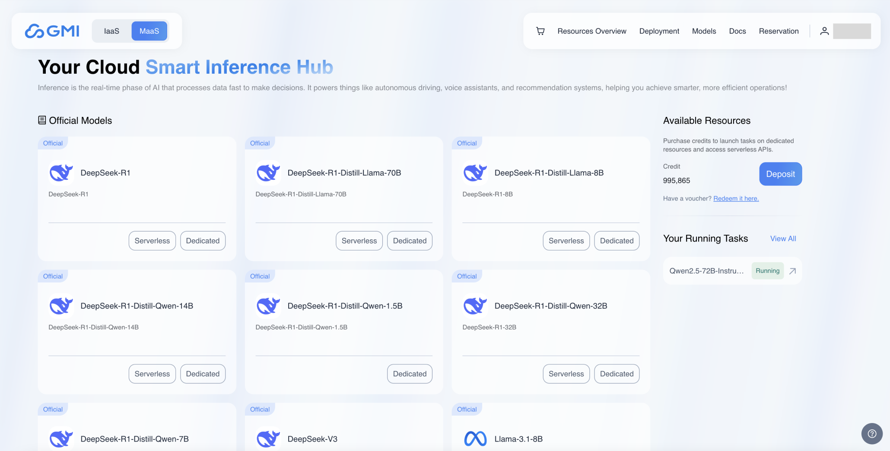

# Serverless Endpoints
We offer a range of serverless endpoints for popular open-source models. Click "MaaS" in the top left corner of the navigation bar to view the models available for serverless endpoints.

Choose the model you wish to access, click the "Serverless" button, and then you can begin using the serverless endpoints.

## Model Detail

You can view detailed information about the model and examples of how to use the model's API.

## Playground

We also offer a playground where you can quickly try out the endpoint. Click the "Playground" section to test the endpoint without any setup.

1. Click "Add API Key" to add API key firstly.
2. You can start conversation by inputting prompts.
3. The options outlined serve to customize and control the text generation process of the API:
   * Temperature:  Temperature allows you to configure how much randomness you want in the generated text. A higher temperature leads to more “creative” results. On the other hand, setting a temperature of 0 will allow you to generate deterministic results which is useful for testing and debugging. 
   * Max Tokens:  Max Tokens defines the maximum number of tokens the model can generate, with a default of 4096. If the combined token count (prompt + output) exceeds the model’s limit, it automatically reduces the number of generated tokens to fit within the allowed context.
   * Top K:  Top-K is another sampling method where the k most probable tokens are filtered and the probability mass is redistributed among tokens.
   * Top P:  Top-P (also called nucleus sampling) is an alternative to sampling with temperature, where the model considers the results of the tokens with top_p probability mass. So 0.1 means only the tokens comprising the top 10% probability mass are considered.
   * Frequency Penalty:  Frequency penalty reduces repetition of the same words/phrases.A higher frequency penalty reduces the likelihood of the model generating tokens that have already appeared in the output. This helps create more varied and engaging text by preventing redundancy.
   * Presence Penalty:  Presence penalty encourages the introduction of new ideas/concepts.A higher presence penalty encourages the model to introduce new ideas or concepts rather than reiterating previously mentioned ones. This can enhance the richness of the generated content by promoting the introduction of fresh topics.
   * Stream:  Steam enables output to be processed and displayed incrementally, meaning that outputs are sent back to the user in real time.
   * System Prompt:  System prompt serves as a high-level instruction or context-setting mechanism that guides the model's behavior, tone, and responses throughout the interaction. 