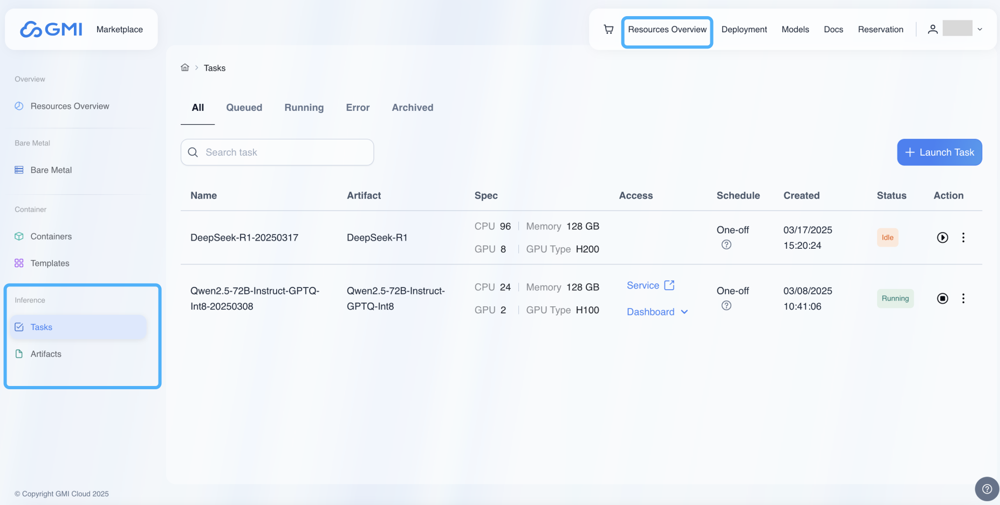

# Resources
A dedicated endpoint can be created by launching tasks from both official and custom models.  

Official models are provided by GMI Cloud.  
Custom models are built by creating artifacts. Artifacts manage model components and their dependencies, including Docker containers, model files, and associated scripts, offering secure storage and versioning capabilities for all deployment elements.

Click "Resources Overview" in the upper right corner of the menu. Then you will see "Tasks" and "Artifacts" in the left-hand menu.

